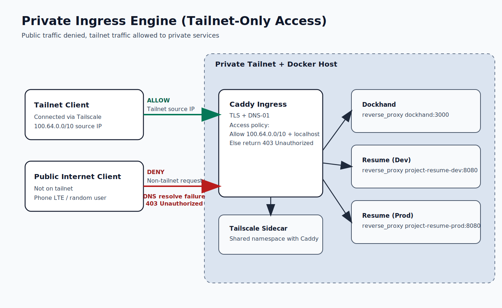

# Private Ingress Engine



Completely Private, self-hosted Ingress Engine for running & exposing services on a tailnet, with custom domains and subdomains, i.e. `service.{DOMAIN}`.

This stack combines:

- Tailscale for the private network overlay
- Caddy for TLS + reverse proxy
- Domain name provider with API support for ACME DNS-01 (Cloudflare / Porkbun /
  etc.)
- DNS rewrite service (i.e. NextDNS / CoreDNS / Pi-hole / AdGuard Home)
- Secrets management for config / token safekeeping (Using 1Password here as an example)

## How It Works

1. `tailscale` runs in a container and joins your tailnet.
2. `caddy` shares the Tailscale network namespace (`network_mode: service:tailscale`).
3. Caddy terminates TLS using DNS-01 and proxies to local services.
4. Requests are blocked unless they originate from the tailnet IP range or
   localhost.

## Requirements

- Docker + Docker Compose
- A Tailscale auth key to initialize the Tailscale container
- API token with minimum necessary permissions
    - e.g. A Cloudflare API token with `Zone:Read` & `DNS:Edit` permissions
- DNS rewrites to point your domain to tailscale container's tailnet ip
- Secrets management

## Quick Start

NOTE: Example commands using 1Password to store config / tokens & Cloudflare for DNS
API access. But they can be swapped with your own preferred solutions.

1. (Optional) Run Dockhand on the shared edge network:

```bash
# Create the `edge` network
docker network create edge

# Run Dockhand
docker run -d \
  --name dockhand \
  --restart unless-stopped \
  --network edge \
  -v /var/run/docker.sock:/var/run/docker.sock \
  -v dockhand_data:/app/data \
  fnsys/dockhand:latest
```

2. Start the ingress engine stack (requires the Cloudflare DNS API token in 1Password):

```bash
op run --env-file .env.temmplate -- docker compose up -d
```

3. Verify Tailscale is connected:

```bash
docker compose exec tailscale tailscale status
```

## Configuration

### Caddyfile

Caddy configuration lives in `conf/Caddyfile`.

Current hostnames and upstreams:

- `dockhand.{DOMAIN}` -> `dockhand:3000`

All upstreams live on the shared `edge` Docker network.

### Running app stacks on the shared `edge` network

Using my [Project Resume](https://github.com/TheClooneyCollection/project-resume), an 11ty resume web app & pdf generator, as an example

```bash
git clone https://github.com/TheClooneyCollection/project-resume
cd project-resume

# Make sure you have set up the `edge` network
docker compose -f compose.yml -f compose.edge.yml up -d
```

### Tailnet restriction

- Only allow `100.64.0.0/10` and `127.0.0.1/32`
- All other IPs receive `403 Unauthorized`

TLS:

- The example caddy configuration shows using Cloudflare DNS-01 via `CF_DNS_API_TOKEN`
- Explicit resolvers to bypass Tailscale/DNS overrides

## Operations

- Logs: `docker compose logs -f caddy`
- Restart: `docker compose restart caddy`

## Notes

- `tailscale` state is persisted at `tailscale/state`.
- `caddy` data/config volumes are named `caddy_data` and `caddy_config`.
